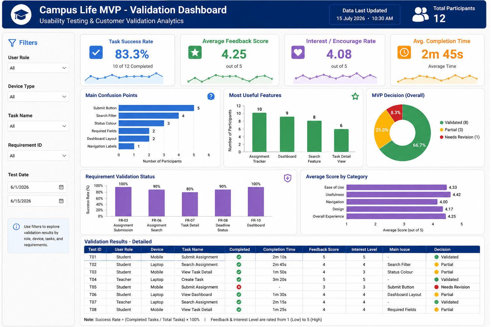

# 📊 Campus Life MVP Validation Dashboard

## Overview

This dashboard summarizes the customer validation results collected during MVP usability testing for the **Campus Life – Student Project Management System**.

The dashboard visualizes key performance indicators (KPIs), participant feedback, usability metrics, and validation evidence to support the final MVP decision.

---

## Dashboard KPIs

| KPI | Result | Status |
|------|-------:|:------:|
| Total Participants | 12 | ✅ |
| Completed Tasks | 10 | ✅ |
| Success Rate | 83.3% | ✅ |
| Average Feedback Score | 4.25 / 5 | ✅ |
| Interest Level | 4.08 / 5 | ✅ |

---

## Dashboard Visualizations

### KPI Cards

- Total Participants
- Success Rate
- Average Feedback Score
- Interest Level

---

### Charts

#### Main Confusion Points

- Submit Button
- Search Filter
- Status Colours
- Required Fields
- Dashboard Layout

---

#### Most Useful Features

- Assignment Tracker
- Dashboard
- Search
- Task Detail View

---

#### MVP Decision

- ✅ Validated
- ⚠ Partially Validated
- ❌ Needs Revision

---

#### Requirement Validation

- FR-03 Assignment Submission
- FR-06 Assignment Search
- FR-07 Task Detail
- FR-08 Deadline Status
- FR-10 Dashboard

---

## Validation Results

| Test ID | Completed | Feedback | Interest | Decision |
|----------|-----------|----------|----------|----------|
| T01 | Yes | 5 | 5 | Validated |
| T02 | Yes | 4 | 4 | Validated |
| T03 | Yes | 4 | 3 | Partial |
| T04 | Yes | 5 | 5 | Validated |
| T05 | No | 3 | 3 | Revise |
| T06 | Yes | 4 | 4 | Validated |
| T07 | Yes | 4 | 4 | Validated |
| T08 | Yes | 4 | 4 | Validated |
| T09 | Yes | 5 | 5 | Validated |
| T10 | Yes | 4 | 4 | Validated |
| T11 | No | 3 | 3 | Revise |
| T12 | Yes | 4 | 4 | Validated |

---

## Dashboard Filters

- User Role
- Device Type
- Requirement ID
- Task Name

---

## Key Findings

- 83.3% task completion rate
- Average feedback score of 4.25/5
- Average interest level of 4.08/5
- Assignment Tracker received the highest usefulness rating
- Navigation requires minor improvements
- Dashboard layout is generally well received

---

## Improvement Priorities

### High Priority

- Improve Submit Button visibility
- Improve Search Filters
- Improve Status Colours

### Medium Priority

- Improve Dashboard Layout
- Improve Form Guidance

### Low Priority

- Improve Typography
- Improve Visual Consistency

---

## Final MVP Decision

**✅ VALIDATED**

The Campus Life MVP successfully exceeded all predefined success metrics.

- Success Rate ≥ 70% ✔
- Feedback Score ≥ 4.0 ✔
- Interest Level ≥ 4.0 ✔

The MVP is considered suitable for further development with only minor usability improvements.

---

## Repository Structure

```
ICT105-STT-MVP
│
├── data
│   ├── validation-results.csv
│   └── raw-responses.xlsx
│
├── screenshots
│   └── project-dashboard.png
│
├── docs
│   ├── analytics-insights.md
│   ├── customer-validation-summary.md
│   └── mvp-decision.md
│
└── README.md
```

---

## Team

**Project:** Campus Life – Student Project Management System

**Course:** ICT105 – Fundamental Technology Entrepreneurship

**Team:** STT

**Dashboard Author:** Sut Lat Shawng

---

© 2026 ICT105-STT-MVP
# Analytics Insights Report

## Validation Dashboard


